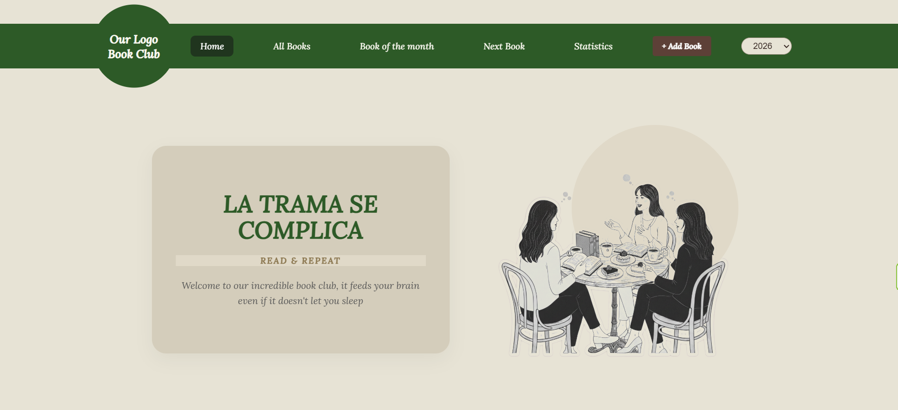

# 📚 Full-Stack Personal Book App

A professional web platform designed to manage a personal library, track reading progress, and organize books by status, months, and ratings. This project showcases a full-stack integration between a modern React frontend and a robust FastAPI backend.

## 📸 Screenshots

---

## 🚀 Key Features
* **Full CRUD Management:** Create, Read, Update, and Delete books, reviews, and reading dates.
* **Workflow Automation:** Seamlessly move books between *Recommended*, *Reading*, and *Read* status.
* **Smart Sorting:** Automatic chronological sorting by reading month (January - December) and year.
* **Cloud Database:** Successfully migrated from local SQLite to **PostgreSQL (Neon.tech)** for professional-grade data persistence.
* **Responsive UI:** Custom-built components with a focus on user experience and clean aesthetics.

## 🛠️ Tech Stack

**Frontend:**
* React.js (Vite)
* React Router
* Custom SCSS (Modular & Responsive)

**Backend:**
* Python + FastAPI
* SQLModel (ORM & Pydantic validation)
* PostgreSQL (Neon.tech)
* **Web Scraping:** BeautifulSoup4 & Urllib (Real-time book data extraction)

**Deployment:**
* Database: Neon.tech
* Backend: [Render Link](https://book-club-uqix.onrender.com)
* Frontend: [Live Site](https://book-club-hub-seven.vercel.app)

* ## 🔑 Environment Variables
To run this project, you will need to create a `.env` file in the `/backend` folder with the following variables:
- `DATABASE_URL`: Your PostgreSQL connection string (Neon.tech).

## ⚙️ Setup & Installation

### 1. Prerequisites
* Python 3.10+
* Node.js 18+

### 2. Backend Setup
```bash
cd backend
python -m venv venv
source venv/bin/activate  # On Windows: venv\Scripts\activate
pip install -r requirements.txt
python main.py # or uvicorn main:app --reload
# The tables will be created automatically in your DB 
# the first time the server runs.
```

## 🚀 Next Steps & Future Improvements

### 🛠️ UX & UI improvements
- [ ] **Skeleton Screens**: Add loading screens.
- [ ] **Custom React modals**: Modify the `window.confirm` for something more personal.
- [ ] **Dark Mode**: Add option to dark mode.

### 📚 New functionalities
- [ ] **Authentication system**: Only been able add or delete books or reviews if you are an user.
